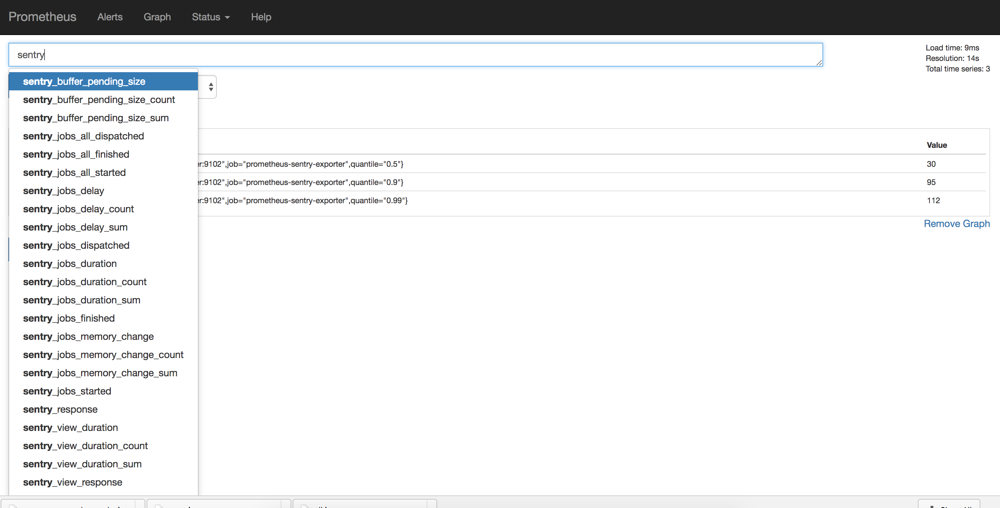

## Monitor hosted sentry with prometheus

Since sentry does not support prometheus as a monitoring backend, we can send `StatsdMetricsBackend` metrics to 
[statsd_exporter] and configure prometheus to scrape them.

[statsd_exporter]: https://github.com/prometheus/statsd_exporter


### Demo:



### TODO

- [ ] Add grafana dashboard
- [ ] Deploy to kubernetes/minikube

### Test

```shell
docker-compose build
docker-compose up
```

- to view the scraped metrics in prometheus navigate to `http://localhost:9090/`

- to view the translated statsd metrics navigate to 
`http://localhost:9102/metrics`

### Notes:

- The first time you do `docker-compose up`, you need to run:
    - `docker exec -it <sentry_web_container_id> bash`

    - `sentry upgrade` (we need to create database tables, and create a superuser account).
    - `docker-compose stop`
    - `docker-compose up`

- The statsd metrics backend is configured in `sentry.conf.py`.
Ref: (https://github.com/getsentry/sentry/blob/master/docs/internal-metrics.rst)

```python
# Sentry statsd exporter config
SENTRY_METRICS_BACKEND = 'sentry.metrics.statsd.StatsdMetricsBackend'
SENTRY_METRICS_OPTIONS = {
    'host': os.environ.get('SENTRY_METRICS_HOST'),
    'port': os.environ.get('SENTRY_METRICS_PORT')
}
```
